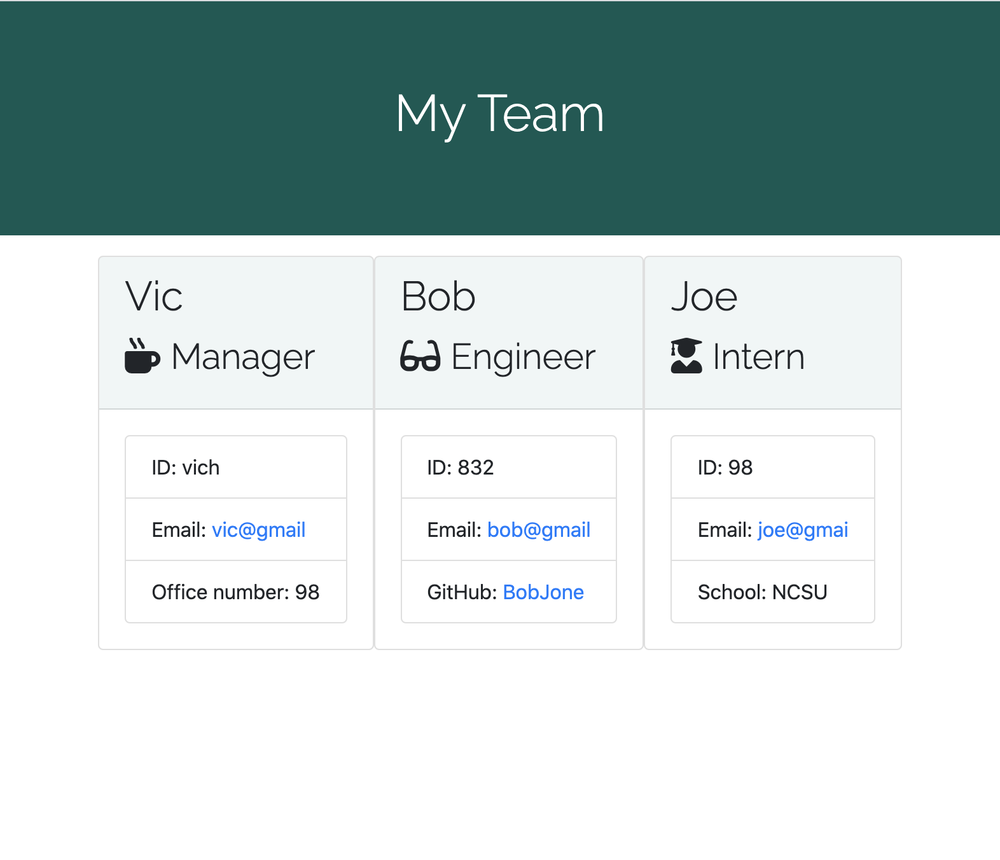

# TeamGenerator
This app was created so that you can enter information about your individuals at work, and then build a team. After the questions are answered, it will result in collecting each team member's information and display it on an html page. This was created by using Node.js, CSS, HTML, and Inquirer.

The link for the repository: https://github.com/victoriahunter11/TeamGenerator

Here is what the page looks like when you are answering questions:

Here is the HTML page that it generates for you:

If you click the picture above, you will be taken to this video of my demo.

